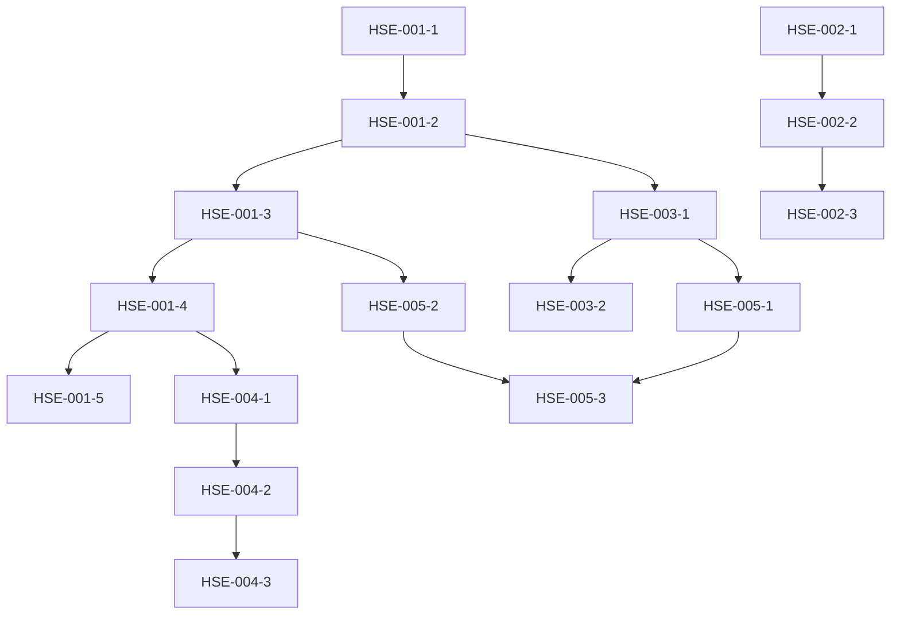

# Epic: HSE Solution Foundation and Architecture Setup

## Epic Title
HSE-EPIC-001: Initial HSE Solution Setup and Architecture Foundation

## Epic Summary
Establish the foundational architecture for the Digital HSE Management System by integrating CoreUI React into the existing .NET 8 solution, setting up core infrastructure, and implementing base HSE domain models with Indonesian regulatory compliance support.

## Business Value
- **Accelerate Development**: Reduce development time by 30-40% using integrated monorepo approach
- **Cost Optimization**: Stay within Rp. 250,000,000 annual budget using open-source tools
- **Compliance Ready**: Built-in support for Indonesian HSE regulations from day one
- **Single Developer Friendly**: Optimized workflow for efficient full-stack development

## Epic Description

### Background
The British School Jakarta requires a comprehensive HSE Management System to replace manual processes and achieve digital transformation objectives. This epic establishes the technical foundation using our existing .NET 8 architecture enhanced with CoreUI React for rapid UI development.

### Scope
This epic covers:
1. CoreUI React integration into the .NET 8 Web project
2. Core HSE domain model implementation
3. Database schema with Indonesian compliance fields
4. Authentication and authorization setup
5. Multi-language support (English/Bahasa Indonesia)
6. Development environment configuration
7. CI/CD pipeline setup for Biznet Gio deployment

### Out of Scope
- Detailed HSE business logic (covered in subsequent epics)
- Mobile application development
- Advanced analytics and reporting
- Third-party integrations

## Acceptance Criteria

### Technical Setup
- [ ] CoreUI React successfully integrated within DigitalHSE.Web project
- [ ] Single `dotnet run` command starts both API and React development servers
- [ ] Hot reload working for both C# and TypeScript changes
- [ ] TypeScript types auto-generated from C# models
- [ ] Docker containerization supports single-image deployment

### Architecture Foundation
- [ ] HSE domain models created (Incident, Risk, Permit, Compliance)
- [ ] PostgreSQL schema includes Indonesian regulatory fields
- [ ] Repository pattern implemented for data access
- [ ] CQRS pattern established with MediatR
- [ ] Audit trail functionality for all entities

### User Interface
- [ ] CoreUI navigation configured for HSE modules
- [ ] Base layout with HSE branding (green theme)
- [ ] Responsive design working on desktop and tablet
- [ ] Loading states and error handling implemented
- [ ] Multi-language toggle (EN/ID) in UI header

### Authentication & Security
- [ ] JWT authentication working for API and SPA
- [ ] Role-based access control (Admin, HSE Manager, User)
- [ ] Secure password reset flow
- [ ] Session timeout handling
- [ ] CORS properly configured for development

### Development Experience
- [ ] VS Code tasks configured for full-stack debugging
- [ ] Swagger UI accessible with authentication
- [ ] Environment-specific configuration (dev/staging/prod)
- [ ] Git hooks for code quality (linting, formatting)
- [ ] README updated with setup instructions

## Technical Requirements

### Technology Stack
```yaml
Backend:
  - .NET 8 LTS
  - Entity Framework Core 8
  - PostgreSQL 15
  - Redis 7 (caching)
  - MediatR (CQRS)
  - FluentValidation
  - Serilog (structured logging)

Frontend:
  - React 18.2+
  - TypeScript 5.0+
  - CoreUI React 5.x
  - Axios (API calls)
  - React Query
  - React Hook Form
  - i18next (internationalization)

Infrastructure:
  - Docker & Docker Compose
  - GitHub Actions (CI/CD)
  - Let's Encrypt (SSL)
```

### Project Structure
```
digital-hse/
├── src/
│   ├── DigitalHSE.Web/
│   │   ├── ClientApp/              # CoreUI React application
│   │   ├── Controllers/
│   │   ├── Program.cs
│   │   └── appsettings.json
│   ├── DigitalHSE.Application/
│   │   └── HSE/                    # HSE business logic
│   ├── DigitalHSE.Domain/
│   │   └── HSE/                    # HSE domain models
│   └── DigitalHSE.Infrastructure/
│       └── HSE/                    # HSE data access
├── tests/
├── docker-compose.yml
└── .github/workflows/
```

## User Stories

### Setup Stories
```
HSE-001: As a developer, I want to integrate CoreUI React into the .NET 8 solution
Given I have the existing .NET 8 solution
When I run the setup commands
Then CoreUI React should be properly integrated in the ClientApp folder
And both frontend and backend should run with a single command

HSE-002: As a developer, I want automated TypeScript type generation
Given I have C# DTOs in my API
When I run the type generation script
Then TypeScript interfaces should be created automatically
And API calls should have full type safety
```

### Domain Model Stories
```
HSE-003: As an architect, I want HSE domain models with audit support
Given I need to track all HSE entities
When I create domain models
Then each entity should have audit fields (CreatedBy, CreatedAt, ModifiedBy, ModifiedAt)
And soft delete should be implemented

HSE-004: As a compliance officer, I want Indonesian regulatory fields
Given Indonesian law requires specific HSE reporting
When I design the database schema
Then incidents table should include BPJS and Ministry of Manpower fields
And regulatory deadlines should be automatically calculated
```

### Authentication Stories
```
HSE-005: As a user, I want secure authentication
Given I need to access the HSE system
When I login with valid credentials
Then I should receive a JWT token
And the token should work for both API and React app

HSE-006: As an admin, I want role-based access control
Given different users have different permissions
When I assign roles to users
Then access to features should be restricted based on roles
And unauthorized access should return 403 Forbidden
```

### Localization Stories
```
HSE-007: As an Indonesian user, I want the interface in Bahasa Indonesia
Given I prefer Bahasa Indonesia
When I toggle the language selector
Then all UI text should switch to Indonesian
And the preference should be saved

HSE-008: As a developer, I want maintainable translations
Given we support multiple languages
When I add new UI text
Then I should use translation keys
And missing translations should fallback to English
```

## Dependencies

### External Dependencies
- [ ] PostgreSQL database server available
- [ ] Redis server for caching
- [ ] Node.js 18+ for frontend build
- [ ] .NET 8 SDK installed
- [ ] Docker Desktop for containerization

### Internal Dependencies
- [ ] Access to existing DigitalHSE GitHub repository
- [ ] Biznet Gio account for deployment planning
- [ ] SSL certificate for HTTPS

## Definition of Done

- [ ] Code reviewed and approved by tech lead
- [ ] Unit tests written with >80% coverage
- [ ] Integration tests for critical paths
- [ ] Documentation updated in README
- [ ] No critical security vulnerabilities (npm audit, dotnet scan)
- [ ] Successfully deployed to development environment
- [ ] Swagger documentation auto-generated
- [ ] Performance baseline established (<3s page load)

## Success Metrics

### Technical Metrics
- **Build Time**: < 5 minutes for full build
- **Startup Time**: < 10 seconds for development server
- **Response Time**: < 200ms for API endpoints
- **Bundle Size**: < 1MB for initial React bundle

### Development Metrics
- **Setup Time**: New developer onboarded in < 2 hours
- **Hot Reload**: Changes reflected in < 2 seconds
- **Type Safety**: 100% of API calls have TypeScript types
- **Code Coverage**: > 80% for business logic

## Risk Mitigation

| Risk | Impact | Mitigation |
|------|--------|------------|
| CoreUI learning curve | Medium | Use CoreUI templates and examples extensively |
| Performance issues with integrated solution | Low | Implement proper caching and lazy loading |
| Complex debugging across stack | Medium | Setup VS Code compound debugging |
| Database schema changes | High | Use EF Core migrations from start |

## Estimated Effort

### Story Points: 21
- CoreUI Integration: 5 points
- Domain Models: 3 points
- Database Setup: 3 points
- Authentication: 5 points
- Localization: 3 points
- DevOps Setup: 2 points

### Timeline: 2-3 weeks for single developer
- Week 1: CoreUI integration and setup
- Week 2: Domain models and authentication
- Week 3: Localization and testing

## Technical Notes

### Quick Start Commands
```bash
# Clone and setup
git clone https://github.com/risky-biz/digital-hse.git
cd digital-hse

# Install CoreUI
cd src/DigitalHSE.Web
npx @coreui/coreui-react-app@latest ClientApp --template typescript

# Configure for integrated development
dotnet new tool-manifest
dotnet tool install dotnet-ef

# Run everything
docker-compose up -d  # PostgreSQL, Redis
dotnet watch run      # Starts API and React
```

### Key Configuration Files

**appsettings.Development.json**
```json
{
  "ConnectionStrings": {
    "DefaultConnection": "Host=localhost;Database=DigitalHSE;Username=postgres;Password=postgres"
  },
  "Jwt": {
    "Secret": "your-256-bit-secret-key-for-development",
    "Issuer": "DigitalHSE",
    "Audience": "DigitalHSE"
  },
  "Redis": {
    "ConnectionString": "localhost:6379"
  }
}
```

**ClientApp/package.json additions**
```json
{
  "proxy": "https://localhost:5001",
  "scripts": {
    "generate-types": "openapi-typescript https://localhost:5001/swagger/v1/swagger.json --output ./src/types/api.d.ts"
  }
}
```

## Related Documentation

- [CoreUI React Documentation](https://coreui.io/react/docs/)
- [.NET 8 SPA Integration](https://docs.microsoft.com/en-us/aspnet/core/client-side/spa/react)
- [PostgreSQL Indonesian Compliance Schema](/docs/database-schema.md)
- [HSE Domain Model Specifications](/docs/domain-models.md)

## Questions/Clarifications Needed

1. Confirm Biznet Gio account details for deployment planning
2. Verify specific Indonesian regulatory fields required
3. Confirm HSE role hierarchy for RBAC implementation
4. Review HSE color scheme and branding requirements

## Sub-Tasks Breakdown

### Week 1: Frontend Foundation (40 hours)

#### Task Group: CoreUI Integration
- **HSE-001-1**: Setup CoreUI React in ClientApp folder (4h)
  - Install CoreUI React template with TypeScript
  - Configure package.json scripts
  - Verify development server runs correctly
  
- **HSE-001-2**: Configure ASP.NET Core SPA hosting in Program.cs (2h)
  - Add SPA middleware configuration
  - Setup static file serving
  - Configure production build path
  
- **HSE-001-3**: Setup development proxy and hot reload (2h)
  - Configure proxy for API calls
  - Ensure hot reload works for both frontend and backend
  - Setup VS Code compound debugging

#### Task Group: UI Foundation
- **HSE-001-4**: Create base CoreUI layout with HSE navigation (4h)
  - Implement sidebar with HSE modules
  - Create header with user menu
  - Setup routing for main sections
  
- **HSE-001-5**: Implement HSE color theme and branding (2h)
  - Create custom SCSS with HSE green theme
  - Add BSJ logo and branding elements
  - Configure CoreUI variables for HSE colors

### Week 2: Backend Foundation (40 hours)

#### Task Group: Domain Modeling
- **HSE-002-1**: Create HSE domain models (4h)
  - Implement Incident entity with audit fields
  - Create Risk Assessment entity
  - Design Permit-to-Work entity
  - Add Compliance tracking entities
  
- **HSE-002-2**: Setup PostgreSQL schema with Indonesian fields (4h)
  - Create HSE-specific schemas (incidents, risks, compliance)
  - Add Indonesian regulatory fields (BPJS, Ministry reporting)
  - Implement audit trail tables
  - Create indexes for performance
  
- **HSE-002-3**: Implement repository pattern for HSE entities (4h)
  - Create generic repository interface
  - Implement HSE-specific repositories
  - Add unit of work pattern
  - Setup dependency injection

#### Task Group: Authentication & Authorization
- **HSE-003-1**: Configure JWT authentication (4h)
  - Setup JWT token generation
  - Implement refresh token mechanism
  - Configure token validation
  - Add authentication middleware
  
- **HSE-003-2**: Implement role-based authorization (4h)
  - Define HSE roles (Admin, HSE Manager, Safety Officer, User)
  - Create permission matrix
  - Implement authorization policies
  - Add role-based menu filtering

### Week 3: Integration & Polish (40 hours)

#### Task Group: Internationalization
- **HSE-004-1**: Setup i18next for multi-language support (2h)
  - Install and configure i18next
  - Setup language detection
  - Configure translation namespaces
  
- **HSE-004-2**: Create translation files (EN/ID) (4h)
  - Create English translation file
  - Create Bahasa Indonesia translation file
  - Translate common UI elements
  - Add HSE-specific terminology translations
  
- **HSE-004-3**: Implement language toggle in UI (2h)
  - Add language selector to header
  - Persist language preference
  - Test all UI elements switch properly

#### Task Group: Developer Experience
- **HSE-005-1**: Setup TypeScript type generation (2h)
  - Configure OpenAPI spec generation
  - Setup automatic TypeScript type generation
  - Create npm script for type updates
  - Verify type safety in API calls
  
- **HSE-005-2**: Create Docker configuration (2h)
  - Create multi-stage Dockerfile
  - Setup docker-compose for local development
  - Configure environment variables
  - Test containerized deployment
  
- **HSE-005-3**: Documentation and testing (4h)
  - Update README with setup instructions
  - Write unit tests for critical paths
  - Create developer onboarding guide
  - Document API endpoints in Swagger

### Subtask Dependencies



### Definition of Done for Each Subtask

**Frontend Tasks (HSE-001-x)**
- Component renders without errors
- Responsive on desktop and tablet
- No console warnings or errors
- Code follows ESLint rules

**Backend Tasks (HSE-002-x, HSE-003-x)**
- Unit tests written and passing
- No compiler warnings
- Code reviewed for security
- Database migrations created

**Integration Tasks (HSE-004-x, HSE-005-x)**
- End-to-end functionality tested
- Documentation updated
- No regression in existing features
- Performance benchmarks met

---

**Epic Owner**: [Tech Lead Name]  
**Created Date**: [Current Date]  
**Target Completion**: End of Month 1  
**Labels**: `foundation`, `architecture`, `high-priority`